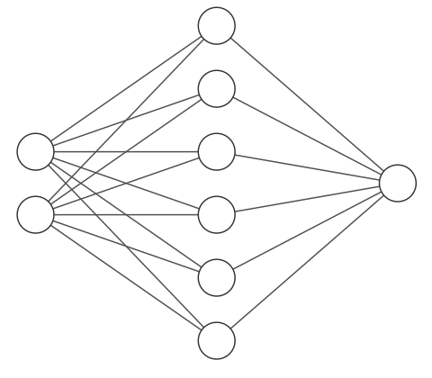
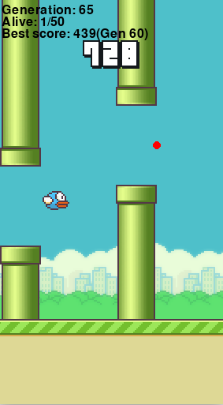

# Flappy Bird - Genetic Neural Network

Machine learning for a Flappy Bird controller.
The game is a modification of the [Flappy Bird clone](https://github.com/sourabhv/FlapPyBird) made by sourabhv.
The method for learning the controller is based on neural networks and genetic algorithms, Genetic Neural Network (GNN).
The GNN has been created from scratch with Numpy, the source code can be found in _ML/geneticNN.py_

## Neural network

Architecture:

Input:

- normalized horizontal distance between the midpoint of the bird and the end of the nearest gap
- normalized vertical distance between the midpoint of the bird and the center of the nearest gap

Output: if output > 0.5 then flap

## Genetic algorithm

1. Generate a new population of NNs with random weights.
2. The population plays the game simultaneously.
3. Calculate the fitness (travaled distance) of each NN. Optional: sum previous fitness (multiplied by a factor) to the best NNs of the previous generation
4. Create a new generation from the current NNs:

    - The best K NNs are passed on to the next generation without modification.
    - A 10% of the new population is generated from randomly selected top NNs with mutations.
    - A 10% of the new population is generated from the crossover between 2 NN of the top.
    - The rest of the new population is created from the crossover between 2 NNs chosen at random from the entire current generation.
5. Go to 2.

## Results (in progress)

Parameters:

- Population: 50
- Elitism: 0.2
- Mutation rate: 0.1
- Activation function: sigmoid

Best score 800 at Generation 65

